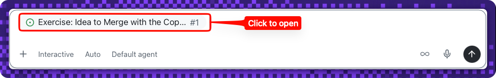

## Step 1: Create an issue from a session in the Copilot App

Welcome, {{login}}! 👋 Every good change starts as an idea. In this exercise you'll take one idea — a small bookmarks app — all the way from a session to a merged pull request, entirely inside the **GitHub Copilot App**.

### 📖 Theory: from a session to a work item

The GitHub Copilot App gives you **agent sessions** that run against your checked-out repository, plus a connected view of its issues and pull requests — all without leaving the app. A great first move is to turn a rough idea into a tracked **issue** so planning and execution live in the same place.

The app you'll build stores each bookmark as two things: the **original URL** and a locally generated **short slug** (a display alias — there's no shortener service or backend).

### Running this exercise in the Copilot App

You'll complete every step **inside the app**, using these surfaces:

| Surface | What it's for |
| --- | --- |
| **Sessions** | Drive the work — start a **New session** on your checked-out repository. For the build in Step 3, you'll start a **dedicated session** that references your app issue and runs the feature on its own branch. |
| **Issue side panel** | Opens a repository **issue** — this walkthrough (**#1**) and the app issue you'll create — pinned beside your session so instructions and graded feedback stay in view. Ask the agent to `open issue #1 in the side panel`. |
| **Browser canvas** | The right side panel renders **live pages** — the README, the pull request, and the running app — with clickable links and buttons. Ask the agent, for example: `open the main readme of this repository in a browser canvas`. |
| **Terminal canvas** | Runs commands you can watch, like the dev server in Step 4 (`npm run dev`). |
| **Files & Changes tabs + editor canvas** | Every session has built-in **Files** and **Changes** tabs for the working tree and diff. You can also open any file in a **lightweight editor canvas** to read or tweak it directly. |

<!-- image: the app's surfaces — a session, the issue side panel, a browser canvas, and the Files/Changes tabs -->

### Resetting or retrying

- Each check re-runs automatically when you re-trigger it (edit the issue, push the file again, or reopen/update the PR).
- If a step's feedback shows a red ❌, follow the **Having trouble?** notes in that step's comment and try again — there's no penalty for retries.
- To start completely fresh, delete your copy and copy the exercise again.

#### References

- [Getting started with the Copilot App](https://docs.github.com/en/copilot/how-tos/github-copilot-app/getting-started)
- [Managing issues and pull requests with the Copilot App](https://docs.github.com/en/copilot/how-tos/github-copilot-app/managing-issues-and-pull-requests)

### ⌨️ Activity 1: Install and connect

> [!NOTE]
> This activity is **app-only** and can't be graded — there's no repository signal for install or sign-in. Complete it to unlock the graded work in Activity 2.

To use the GitHub Copilot app, the first step — as you might imagine — is to install it. Versions are available for Windows, macOS, and Linux. Let's install the app, authenticate, and add your exercise repository to the app.

> [!TIP]
> **New to Node.js?** Step 4 runs the app locally with `npm run dev`, which needs **Node.js 22.12 or newer** (it ships with `npm`). Check what you have with `node --version`; if it's missing or older, install the current LTS from [nodejs.org/en/download](https://nodejs.org/en/download). See [About npm](https://docs.npmjs.com/about-npm) for a quick primer. You won't need it until Step 4, so you can install it now or later.

1. In a browser, open the landing page for the GitHub Copilot app: **https://github.com/features/ai/github-app**. *(This download page is the only step outside the app — everything after install happens inside the Copilot App.)*

   

1. Download the app for your platform and install it, following the steps in [Getting started with the Copilot App](https://docs.github.com/en/copilot/how-tos/github-copilot-app/getting-started) — the source of truth for installing and signing in.

   

1. Open the app once it's installed.
1. Select **Sign in to GitHub** and follow the prompts to authenticate.
1. After authenticating, add your exercise repository. Click the **+** next to **Sessions**, then choose **Repository URL…**.

   

1. Paste the clone URL for the repository you just created — copy it from the block below — then pick your GitHub account and select **Clone**.

   ```
   https://github.com/{{full_repo_name}}
   ```

   

1. **Open the walkthrough issue as a reference — don't build it.** The exercise issue (**#1**) appears above the prompt field; click it (**Click to open**) to open it in the **side panel** for reading. This only *displays* the issue — nothing runs, so the session won't start planning or building.

   **Don't use _Create session from issue_ on #1.** That tells the app to *build* the issue — which is why it jumps straight into Plan mode and starts working. Issue **#1** is your **guide to read**. In **Step 3** you'll build the app issue (**#2**) — there you'll reference it in a dedicated session (type `#2` and press **Tab**) so the agent has it as context without auto-running.

   

1. With issue **#1** open in the side panel, click **New session** in the panel's top-right to get a fresh session for the work in Activity 2.

   

1. In the session, confirm Copilot can see the repository context (for example, ask it to summarize the README).

> [!TIP]
> Need these instructions again later? Open the session panel menu and select **Exercise: Idea to Merge with the Copilot App** to reopen issue **#1** in the side panel anytime.


### ⌨️ Activity 2: Create the app issue from a session

1. In your session, ask Copilot to draft an issue to build the bookmarks app. For example:

   > 
   >
   > ```prompt
   > Draft a GitHub issue and create it in this repository.
   > - Title: "Build the bookmarks app"
   > - Describe an Astro app that saves each bookmark as:
   >   - its original URL, and
   >   - a locally generated short slug
   > - Bookmarks are persisted in the browser
   > ```

1. Make sure the created issue:
   - has a **title that mentions bookmarks** (for example, `Build the bookmarks app`), and
   - has a **body that names both** the **original URL** and the **short slug**.

   <!-- image: created app issue open in the side panel -->

> [!TIP]
> If the session can't see repository context, re-check that **your copy** of the exercise repository is connected before drafting the issue.

<details>
<summary>Having trouble? 🤷</summary><br/>

- Make sure the issue you created is a **new issue**, separate from this walkthrough issue.
- The title must contain the word **bookmark** (any case).
- The body must mention both a **URL** and a **slug**, and be more than a sentence long.
- Edit the issue title or body to re-run the check.
- Still stuck on the app itself? See [Getting started with the Copilot App](https://docs.github.com/en/copilot/how-tos/github-copilot-app/getting-started).

</details>
