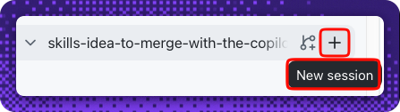
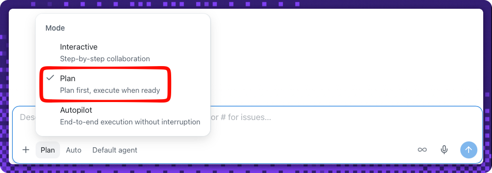
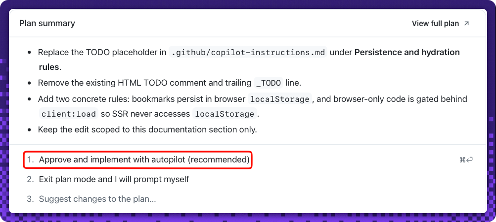
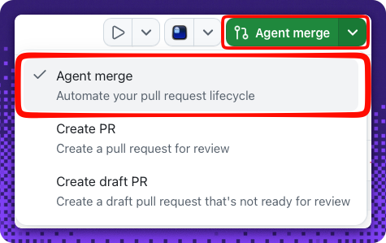
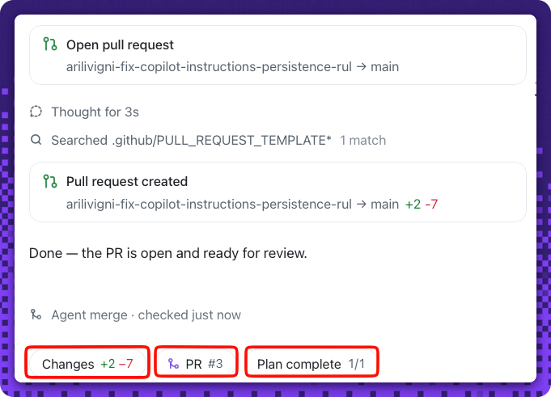
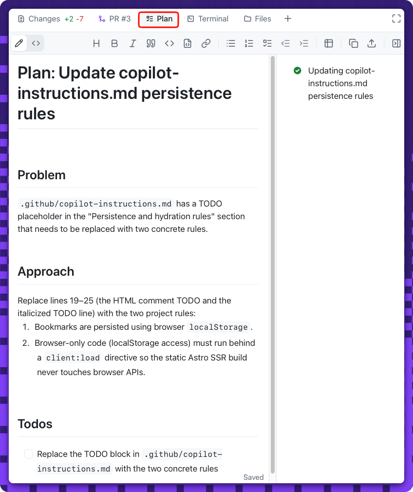
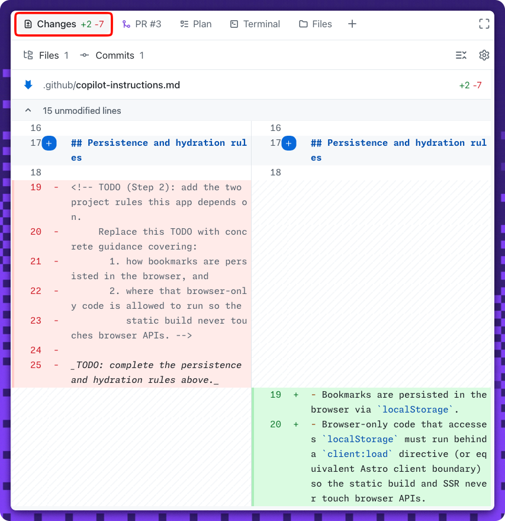
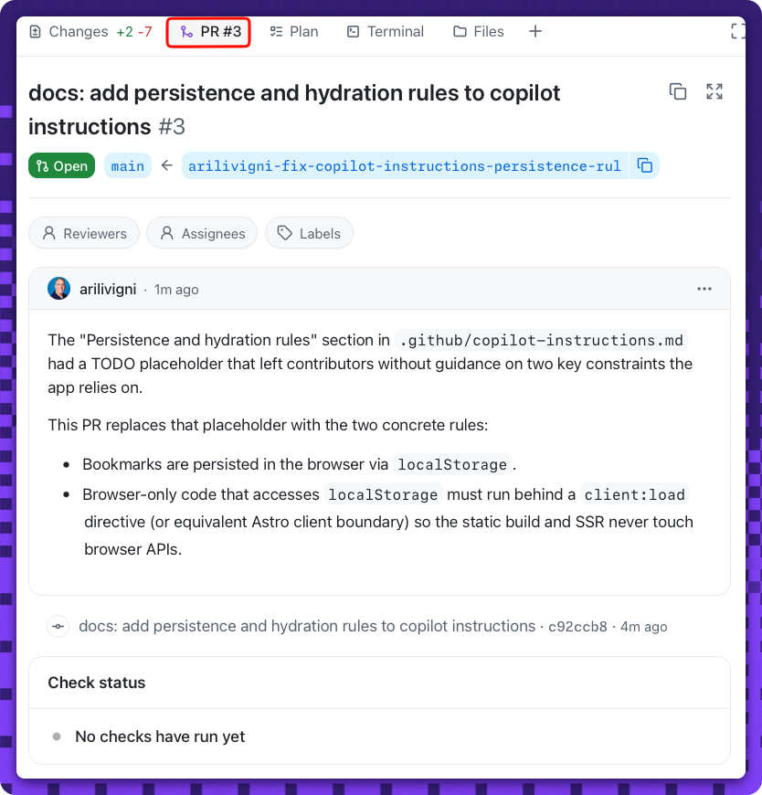

## Step 2: Set the project rules in Copilot instructions

Nice — the work item exists! 🎉 Before you build, set the ground rules so the agent follows your team's conventions from the very first line of code.

### 📖 Theory: custom instructions guide every session

A `.github/copilot-instructions.md` file gives Copilot project context it applies in **every** session in this repository. Getting the rules right now pays off when the build session runs in Step 3.

Two rules matter for this app:

- **Persistence:** bookmarks are stored in the browser using **`localStorage`**.
- **Hydration:** browser-only code must run behind a **client-side boundary** so Astro's static build never touches `localStorage` during SSR. In Astro, that's the **`client:load`** directive (or an inline `<script>`).

Even a light, single-file change is a chance to try **agent merge** — the app's action that **automates the pull request lifecycle**. Instead of committing straight to `main`, you make the edit in a session and let agent merge **open a pull request** for you; you then **review and merge it yourself** in Activity 2. It's the same open-then-merge flow you'll use for the bigger build in Step 3.

> [!IMPORTANT]
> The custom instructions must be on `main` **before** you start the Step 3 build session, because that session branches from `main` and inherits these rules.

#### References

- [Customizing Copilot with repository instructions](https://docs.github.com/en/copilot/how-tos/configure-custom-instructions)
- [Astro client directives](https://docs.astro.build/en/reference/directives-reference/#client-directives)

### ⌨️ Activity 1: Set the rules and open a pull request with agent merge

> [!TIP]
> You can reopen these step instructions anytime: in your session, reference the **Exercise: Idea to Merge with the Copilot App** issue (that's the walkthrough issue **#1** from your first session) to bring it back into the side panel.
>
> 

> [!NOTE]
> This is a **light, single-file edit** made in a session — you'll prompt the agent to update the file, then use **agent merge** to open a pull request. You'll review it and merge it in **Activity 2**.

1. Open a **New session** on your repository — click **New session** in the top-right of the session panel, next to the repository name.

   

1. Switch the session to **Plan** mode from the mode dropdown below the prompt field, so the agent drafts its edit for you to approve before it runs.

   

1. **Prompt the agent to update `.github/copilot-instructions.md`** — replace the seeded `TODO` placeholder with the two project rules:

   > 
   >
   > ```prompt
   > Update .github/copilot-instructions.md: replace the TODO placeholder with the two project rules:
   > - persistence uses browser localStorage, and
   > - browser code runs behind a client:load boundary so SSR never touches localStorage.
   > ```

1. **Approve the plan and let autopilot make the changes.** When the plan summary appears, select **Approve and implement with autopilot (recommended)**. Autopilot applies the single-file edit and opens a pull request for you. You'll review it and merge it in **Activity 2**.

   

   **Agent merge usually happens automatically.** Autopilot typically opens the pull request for you via **agent merge**, so you may never open the action dropdown — the view below is optional. If no pull request appears (or you'd rather trigger it yourself), open the session's action dropdown and select **Agent merge**:

   

   Autopilot then opens the pull request for you:

   

   <details>
   <summary>Explore what autopilot produced 👀</summary><br/>

   Autopilot leaves the session open with tabs you can explore: the **Plan** it followed, the **Changes** diff, and the resulting **pull request**.

   

   

   

   </details>

> [!TIP]
> Be specific to this project (Astro + TypeScript + `localStorage` behind `client:load`). The client-boundary rule is exactly what keeps the Step 3 build from crashing at SSR.

<details>
<summary>Having trouble? 🤷</summary><br/>

- The file must contain the exact tokens **`localStorage`** and **`client:load`**.
- Remove the seeded **`TODO`** marker entirely — the check fails while any TODO remains.
- Still stuck on the app itself? See [Getting started with the Copilot App](https://docs.github.com/en/copilot/how-tos/github-copilot-app/getting-started).

</details>

### ⌨️ Activity 2: Review and merge the change

Review the change agent merge staged, then merge it. When your edit reaches `main`, a **result table** posts to this issue: it checks that `.github/copilot-instructions.md` now names **both** rules — **`localStorage`** and **`client:load`** — and that the seeded **`TODO`** is gone. That table is what advances the exercise, so watch this issue for it.

1. Once you're **satisfied with the changes agent merge made**, merge the pull request from the session — prompt the agent to complete the merge:

   > 
   >
   > ```prompt
   > merge pr
   > ```

1. Confirm the pull request agent merge opened is **merged into `main`** — nothing should be left open. Open it in a browser canvas or the app's **pull request** view.

   <!-- image: merged copilot-instructions pull request in the app -->

1. Confirm `.github/copilot-instructions.md` on `main` now holds the two project rules with **no `TODO`** remaining.

   <!-- image: copilot-instructions.md on main showing the localStorage and client:load rules, no TODO -->

<details>
<summary>Having trouble? 🤷</summary><br/>

- If the result table hasn't posted, make sure agent merge actually **merged** the pull request to `main` (not just opened it) — the check runs on the merge to `main`.
- The table stays red until the file contains **both** `localStorage` and `client:load` and the seeded `TODO` is removed.
- Still stuck on the app itself? See [Getting started with the Copilot App](https://docs.github.com/en/copilot/how-tos/github-copilot-app/getting-started).

</details>
