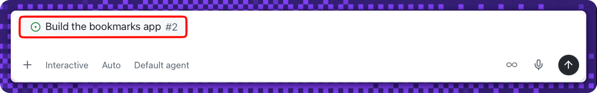
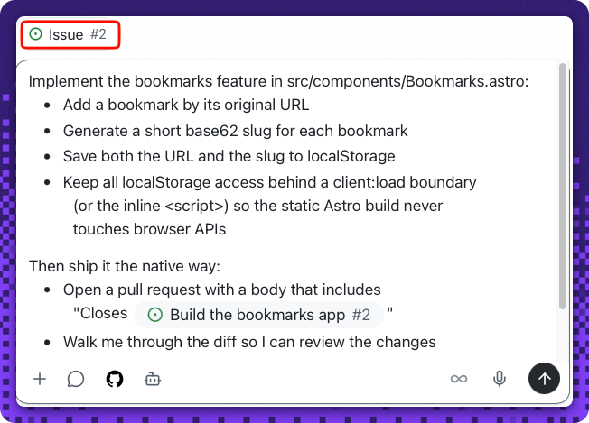
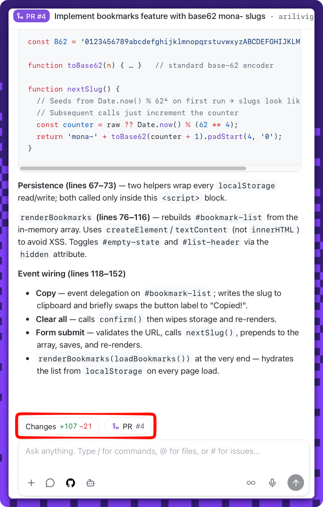
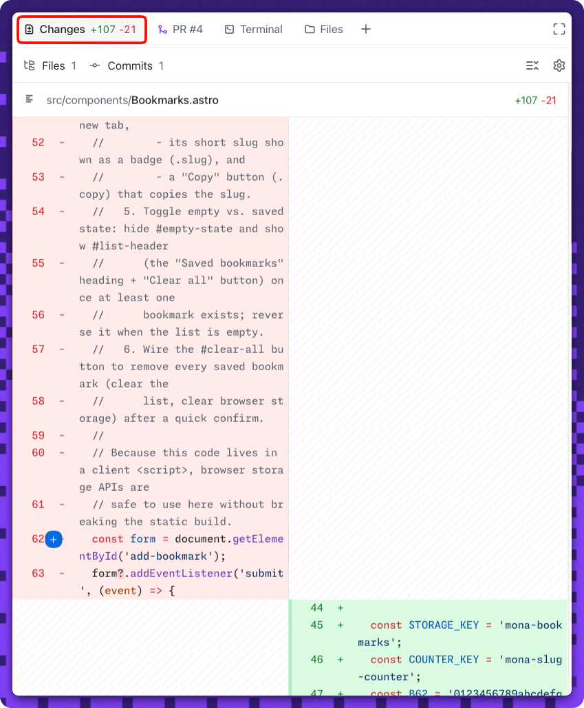
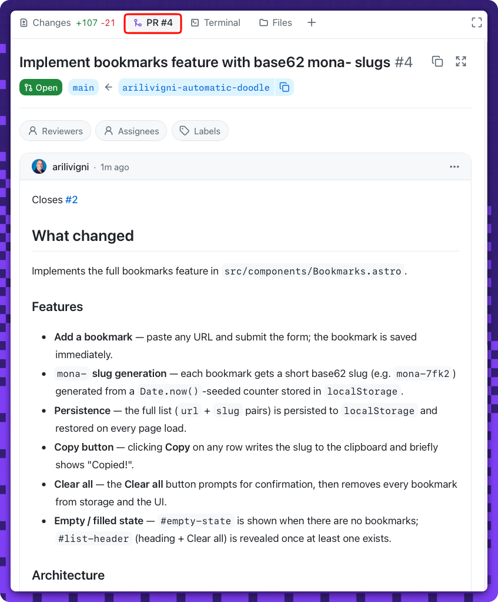

## Step 3: Build, open, and merge the pull request

The rules are set. 🛠️ Now deliver the feature the way a team really does: build it in a dedicated session, open a pull request with **agent merge**, review the diff, and merge it — all in one native flow in the app.

### 📖 Theory: build in a dedicated session

This is where the extra ceremony pays off. Build the feature in a **dedicated session for the app issue** — start a session, reference issue **#2** (type `#2` and press **Tab**) so the work is linked to the right item, then prompt. The session branches from `main`, so it carries your Step 2 instructions, implements the feature on its **own branch**, and opens a pull request — unlike the light `main` edits in Steps 2 and 4.

A few things to know about the build:

- Before it runs, you set three controls below the prompt: **where it runs** (a new working tree, your local repository, or a cloud sandbox), the **session mode** (**Interactive**, **Plan**, or **Autopilot**), and the **model** (**Auto** lets the app pick).
- Each bookmark stores its **original URL** and a locally generated **short slug** (a `mona-` prefixed base62 alias like `mona-7fk2`) — there's **no shortener service or backend**. Bookmarks persist with **`localStorage`**, accessed **only** behind a **`client:load`** boundary so the static build doesn't fail.
- When the diff looks good, **agent merge opens the pull request** for you; you review it and **merge it yourself in Activity 2** — the same open-then-merge flow as Step 2, now on a real feature branch. When you merge, the exercise **closes the linked app issue**, closing the loop back to where you started.

<!-- image: bookmarks UI showing an original URL and its short slug -->

<!-- image: pull request opened from the session -->

> [!IMPORTANT]
> **Complete Step 2 first, and start a fresh session for this build.** A new session branches from the current `main` (which now has your Step 2 instructions), so it picks up the client-boundary rule; reusing the Step 2 session risks a branch that's **behind `main`** and may fail the build check. Keep it **one session per work item**.

#### References

- [Working with agent sessions in the Copilot App](https://docs.github.com/en/copilot/how-tos/github-copilot-app/agent-sessions)
- [Astro components and client directives](https://docs.astro.build/en/reference/directives-reference/#client-directives)

### ⌨️ Activity 1: Build the feature and open the pull request

> [!TIP]
> You can reopen these step instructions anytime: in your session, reference the **Exercise: Idea to Merge with the Copilot App** issue (that's the walkthrough issue **#1** from your first session) to bring it back into the side panel.
>
> 

1. Start a **new session** for this feature. Click **New session** in the top-right of the session panel, next to the repository name — a fresh session branches from the current `main`, so it carries your Step 2 instructions.

   
1. In the new session, open your **Build the bookmarks app** issue: type `#2` in the prompt field and press **Tab** to attach it as context for the build.

   
1. Send the build prompt below. It implements the feature and opens a pull request that links issue **#2** with a closing keyword, then walks you through the diff and **stops — leaving the merge to you**:

   > 
   >
   > ```prompt
   > Implement the bookmarks feature in src/components/Bookmarks.astro:
   > - Add a bookmark by its original URL. Accept any URL format the
   >   user types — with or without "https://" — and normalise it in
   >   JavaScript before saving.
   > - Generate a short base62 slug with a "mona-" prefix (for
   >   example, mona-7fk2) for each bookmark.
   > - Render each saved bookmark with the exact visible separator
   >   " :: " between the URL and slug, for example
   >   https://www.example.com :: mona-7fk2.
   > - Make Mona's Bookmark Manager App look aesthetically pleasing,
   >   and use the Monaspace fonts already wired up in the repo (the
   >   --font-body / --font-head variables in src/layouts/Base.astro)
   >   rather than adding new fonts.
   > - Persist bookmarks under a "mona-bookmarks" key in localStorage
   >   and re-render the saved list on page load so they survive a
   >   reload. Keep all localStorage access behind a client:load
   >   boundary (or the inline <script>) so the static Astro build
   >   never touches browser APIs.
   >
   > Make the storage layer defensive:
   > - Treat localStorage as untrusted. When you load it, validate
   >   that the value is an array of {url, slug} objects and drop
   >   anything malformed — never let raw JSON.parse output flow
   >   straight into the render or add paths.
   > - Handle empty, corrupted, legacy, and non-array stored values
   >   gracefully, without ever throwing.
   > - Make sure a JavaScript error can never let the form fall back
   >   to a native submit that reloads the page and loses the URL —
   >   keep event.preventDefault() as the first thing on submit.
   > - Add unit tests (no browser) around the pure helpers that cover:
   >   - a URL with and without "https://" normalises to the same
   >     saved value;
   >   - loading an empty, corrupted, legacy, or non-array
   >     "mona-bookmarks" value recovers instead of throwing;
   >   - a saved bookmark formats as "<url> :: <slug>" with the exact
   >     " :: " separator.
   >
   > Verify your work without launching a browser:
   > - Run the unit tests and make sure they pass.
   > - Run the production build (npm run build) and make sure it
   >   succeeds — this proves localStorage stays behind the
   >   client:load boundary.
   > Do not open a browser or start the Playwright MCP server in this
   > step; previewing and driving the running app comes in Step 4.
   >
   > Then open a pull request — but don't merge it:
   > - Include "Closes https://github.com/{{full_repo_name}}/issues/2"
   >   in the pull request body.
   > - Walk me through the diff so I can review the changes.
   > - Stop after opening the pull request; I'll merge it myself with
   >   Agent merge.
   > ```

   
1. **Watch the agent test the implementation.** Building the feature includes verifying it — Copilot runs the **unit tests** you asked for and the **production build**, all headless: no browser opens and the Playwright MCP server stays idle. The tests cover URL normalisation, corrupted-storage recovery, and the exact `" :: "` formatting, while the build proves `localStorage` stays behind the `client:load` boundary. You'll preview the app live and drive it with Playwright in **Step 4** — here the tests and build are enough to trust the diff before you merge.

   **Agent merge usually happens automatically.** The agent opens the pull request for you via **agent merge**, so you may never open the action dropdown — the view below is optional. If no pull request appears (or you'd rather trigger it yourself), open the session's action dropdown and select **Agent merge**:

   
1. **Review the diff before you merge.** Agent merge opens the pull request that links issue **#2** for you — review the changes in the session's **Changes** tab (or a browser canvas on the PR). You'll merge it in **Activity 2** once you're satisfied.

   

   <details>
   <summary>Walk the diff before you merge 👀</summary><br/>

   The session keeps the **Changes** diff and the review walkthrough a click apart, so you can read the code before merging in Activity 2.

   

   

   </details>

> [!TIP]
> Need to get back to your **Build the bookmarks app** issue (**#2**)? Open the session panel menu and select it to reopen it in the side panel anytime.


<details>
<summary>Having trouble? 🤷</summary><br/>

- The PR body must contain a closing keyword and an issue number, e.g. `Closes #2`.
- `src/components/Bookmarks.astro` must reference **`localStorage`**.
- The app must build. If the build fails, make sure `localStorage` runs inside the client `<script>` / `client:load` boundary, never at the top of the component frontmatter.
- If adding a bookmark reloads the page or the new entry disappears, make sure the submit handler calls `event.preventDefault()` and that saved bookmarks are re-rendered from `localStorage` on page load.
- If the app crashes on load or after adding, the stored data may be corrupted or not an array. The loader should validate `localStorage` (an array of `{url, slug}`) and drop anything malformed instead of throwing.
- If the pull request wasn't opened, make sure the session used **agent merge** — autopilot uses it automatically, or you can select **Agent merge** from the session's action dropdown.
- Still stuck on the app itself? See [Getting started with the Copilot App](https://docs.github.com/en/copilot/how-tos/github-copilot-app/getting-started).

</details>


### ⌨️ Activity 2: Review and merge the change

Review the diff agent merge staged, then merge it. Watch this issue for **two result tables**: the **build** check when the pull request opened, and the **merge** check once agent merge completes. The merge check also **re-builds `main`**, so the exercise only advances when the shipped app still builds.

1. Once you're **satisfied with the changes agent merge made**, merge the pull request from the session — prompt the agent to complete the merge:

   > 
   >
   > ```prompt
   > merge pr
   > ```

   The pull request body references your **Build the bookmarks app** issue, and merging **closes that linked app issue** for you.

1. Confirm the pull request is **merged into `main`** (open the PR in a browser canvas, or check the **app PR** view).

   <!-- image: merged bookmarks pull request in the app's pull request view -->

1. Confirm the linked **app issue** is now **closed** — merging the pull request wrapped it up.

   <!-- image: linked app issue (Build the bookmarks app) automatically closed -->

<details>
<summary>Having trouble? 🤷</summary><br/>

- If the merge check hasn't posted, make sure agent merge actually **merged** the PR (not just opened it).
- The exercise won't advance if the merged app fails to build. If the build row is red, fix the code on `main` (usually a `localStorage` call outside the `client:load` / `<script>` boundary) and push the fix.
- If the app issue stays open, confirm the PR body used `Closes https://github.com/{{full_repo_name}}/issues/2` (your **Build the bookmarks app** issue) — not the walkthrough issue — then close it manually if needed. The app may render the closing reference as a linked **Issue #2** chip; that's expected — the check accepts it as long as issue **#2** ends up closed.
- Still stuck on the app itself? See [Getting started with the Copilot App](https://docs.github.com/en/copilot/how-tos/github-copilot-app/getting-started).

</details>
