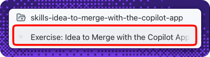
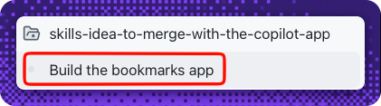
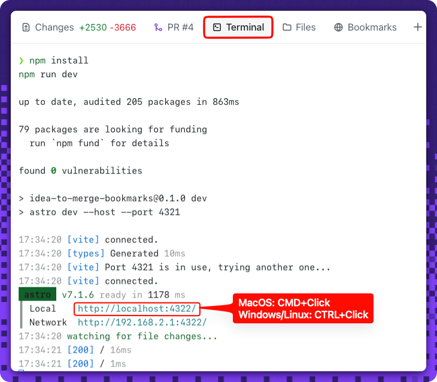
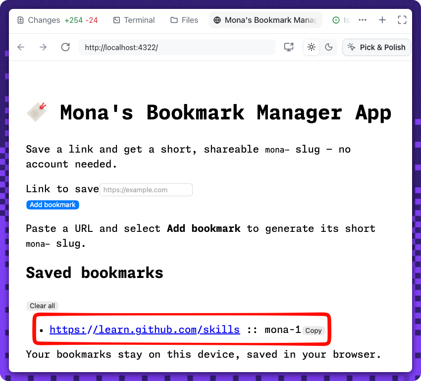

## Step 4: Preview the running app and capture proof with Playwright MCP

Almost there. 🎬 Run the finished app, see it live in a **browser canvas**, let Copilot verify it with the **Playwright MCP** server, and submit the captured screenshot as proof the app works.

### 📖 Theory: preview in a canvas, verify with Playwright MCP

You'll run the app from a **Terminal canvas**, watch it live in a **browser canvas**, then let Copilot drive and screenshot it through the **Playwright MCP server** — no manual capture. A live local URL can't be reached by Actions, so the graded proof is still a committed screenshot; this time Playwright captures it for you.

- Start the dev server in a **Terminal canvas** so you can watch the process run.
- Open a **browser canvas** on the local dev URL (for example, `http://localhost:4321`) to *see* your bookmarks app running — add a link and watch its short slug appear.
- The **Playwright MCP server** gives Copilot a real browser it can navigate, type into, and screenshot. Copilot opens the app, adds a bookmark, verifies the original URL and its short slug both render, then saves the screenshot to `submission/demo-proof.png`.
- This is a **light commit**: the screenshot goes **directly to `main`** — no session or PR.

> [!NOTE]
> Run this session **locally** (choose **a new working tree** or **your local repository** as the run location) so the dev server, the browser canvas, and Playwright can all reach `http://localhost:4321`. In a cloud sandbox, use the forwarded preview URL instead.

<!-- image: the running app previewed in a browser canvas -->

> [!TIP]
> **Playwright is already set up for you.** This repository ships a `.github/mcp.json` that registers the Playwright MCP server, so the Copilot App picks it up automatically — there's nothing to install or configure. The first time Copilot uses it, approve the one-time prompt to trust the server.

#### References

- [Getting started with the Copilot App](https://docs.github.com/en/copilot/how-tos/github-copilot-app/getting-started)
- [Configuring MCP servers in the Copilot App](https://docs.github.com/en/copilot/how-tos/github-copilot-app/customize-github-copilot-app)
- [Playwright MCP server](https://github.com/microsoft/playwright-mcp)

### ⌨️ Activity 1: Preview your app in a browser canvas

See the finished bookmarks app running live — right inside the Copilot App — before you capture your proof.

> [!TIP]
> You can reopen these step instructions anytime: in your session, reference the **Exercise: Idea to Merge with the Copilot App** issue (that's the walkthrough issue **#1** from your first session) to bring it back into the side panel.
>
> 

> [!NOTE]
> This preview is **app-only** and isn't graded — it stands up the running app you'll capture and submit in Activity 2. Leave the dev server running so both the browser canvas and Playwright can reach it.

1. Go back to your **Build the bookmarks app** session from Step 3 — the one that shipped the feature. Open its session panel menu and select **Build the bookmarks app** to bring it back into the side panel:

   

   In that session, open a **Terminal canvas**, install dependencies (first run only), and start the dev server. Leave it running and note the local URL (for example, `http://localhost:4321`):

   > 
   >
   > ```bash
   > npm install
   > npm run dev
   > ```

1. Open a **browser canvas** on that URL to see the app running in the right side panel. The quickest way: in the **Terminal canvas**, **⌘+Click** (macOS) or **Ctrl+Click** (Windows/Linux) the local URL to open it directly in a browser canvas.

   

   Prefer a prompt? You can also ask Copilot:

   ```text
   Open a browser canvas on http://localhost:4321
   ```

   <!-- image: bookmarks app running live in a browser canvas -->

1. In the browser canvas, **add a bookmark** — paste a link (for example, `https://github.com/features/copilot`) and select **Add bookmark**. Confirm both the **original URL** and its generated **short slug** appear in the saved list. That's the app you took from idea to merge, running live.

   

### ⌨️ Activity 2: Capture proof with Playwright MCP and submit

Now let Copilot drive the running app through the **Playwright MCP server**, capture the screenshot, and commit it to `main` as proof the app runs.

> [!NOTE]
> Keep the dev server from Activity 1 **running** in its Terminal canvas — Playwright opens the same local URL.

> [!NOTE]
> **A browser window may open on its own.** By default the Playwright MCP server launches a **headed** (visible) browser, so a separate window appears, navigates to your app, adds the bookmark, and takes the screenshot — then closes itself. That pop-up is expected; let it finish.

> [!TIP]
> **Prefer no pop-up window?** Run Playwright **headless** so nothing appears on screen (it still captures the screenshot). Add the `--headless` flag to the server args in `.github/mcp.json`, then start a new session so the change is picked up:
>
> ```json
> "args": ["@playwright/mcp@latest", "--headless"]
> ```

1. Ask Copilot to verify the app with the Playwright MCP server and capture your proof. The Playwright server is already registered (see the Theory), so this works with no setup. The **first time** you use it, approve the one-time prompt to **trust the server**:

   <!-- image: one-time prompt to trust the Playwright MCP server -->

   ```text
   Using the Playwright MCP server, open http://localhost:4321, add the bookmark
   https://github.com/features/copilot, and confirm the page shows both the original
   URL and a generated short slug. Save a full-page screenshot to
   submission/demo-proof.png, then commit and push that file directly to the
   main branch.
   ```

   <!-- image: the Playwright browser window opening to drive the app and capture the screenshot -->

1. Confirm the proof landed — all from inside the app:
   - Preview `submission/demo-proof.png` from the session's **Files** tab and check it shows at least one bookmark **and** its short slug.
   - Watch the commit reach **`main`** in the session's **Changes** tab (or the **app commits** view). This is a **light commit** — no pull request needed.

<!-- image: demo-proof.png previewed in the session Files tab -->

<!-- image: captured proof — running app with a bookmark and its short slug -->

<details>
<summary>Having trouble? 🤷</summary><br/>

- The file must be exactly `submission/demo-proof.png`, and it must be a real capture (a tiny or empty file will fail the check).
- If Copilot doesn't see browser tools, confirm you're running the session **locally** and approve the one-time prompt to trust the **`playwright`** server registered in `.github/mcp.json`.
- If the browser canvas or Playwright can't reach the URL, make sure `npm run dev` is still running in the Terminal canvas.
- If Playwright can't find the bookmark, remember the app markup exposes stable ids (`#url` input, `#bookmark-list`) — make sure your Step 3 code renders each bookmark into `#bookmark-list`.
- Make sure you pushed to **`main`**.
- Still stuck on the app itself? See [Getting started with the Copilot App](https://docs.github.com/en/copilot/how-tos/github-copilot-app/getting-started).

</details>
