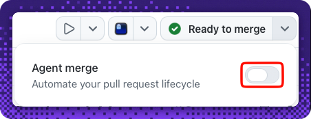
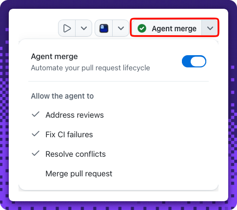

## Step 5: Plan the next release in a canvas

You shipped v1! 🚀 Before you wrap up, use a canvas one more way — not to preview the app, but to **think**. Plan what comes next for **Mona's Bookmark Manager App** and capture it as a roadmap you can act on.

### 📖 Theory: the editor canvas as a planning surface

So far you've used canvases to **run and preview** the app — a Terminal canvas for the dev server, a browser canvas for the live UI. A canvas is also a great place to **author a durable artifact**. Open an **editor canvas** on a new Markdown file and Copilot can draft it right beside your work, where you review and refine it before it lands — the same review-before-you-commit habit from the rest of this exercise, applied to a document instead of code.

- A real project is never "done" — there's always a next feature and a known bug. A short **`ROADMAP.md`** turns that into a plan the whole team can see.
- The editor canvas keeps the draft **reviewable**: you read what Copilot proposes, tweak it, then commit — unlike a throwaway chat reply.
- Once the roadmap exists, its top items become **tracked work** — you'll turn a couple into GitHub issues, closing the loop back to where you started in Step 1.

> [!NOTE]
> This is a **light change**: you'll draft the roadmap in a session, then use **agent merge** to land `ROADMAP.md` on `main` — the same agent merge from Step 2, now for a doc. Agent merge automates the pull request lifecycle, so no manual review is needed for a change this small.

<!-- image: editor canvas open beside the session with a ROADMAP.md draft -->

#### References

- [Getting started with the Copilot App](https://docs.github.com/en/copilot/how-tos/github-copilot-app/getting-started)
- [About issues](https://docs.github.com/en/issues/tracking-your-work-with-issues/about-issues)

### ⌨️ Activity 1: Draft the roadmap in an editor canvas

Let Copilot draft the next-release plan in an editor canvas, then use **agent merge** to land it on `main`.

> [!TIP]
> You can reopen these step instructions anytime: in your session, reference the **Exercise: Idea to Merge with the Copilot App** issue (that's the walkthrough issue **#1** from your first session) to bring it back into the side panel.
>
> 

1. Start a **New session** on your repository — click **New session** in the top-right of the session panel, next to the repository name.

   
1. In the new session, ask Copilot to draft the roadmap and open it in an **editor canvas** so you can review it as it writes:

   > 
   >
   > ```prompt
   > Create ROADMAP.md for Mona's Bookmark Manager App and open it in an
   > editor canvas. Make it visually engaging while keeping it valid
   > GitHub Markdown:
   > - Give it a short title and a one-line intro.
   > - Add a summary table near the top with the columns
   >   | Area | Item | Type | Priority | — one row per roadmap item,
   >   using 🚀 for features and 🐞 for bugs/risks in the Type column.
   >   This is an overview; keep the full bullet lists below it.
   > - Use two emoji section headers: "## 🚀 Planned features" and
   >   "## 🐞 Known bugs & risks".
   > - Under each header, use a Markdown bullet list where every item
   >   is ONE line that starts with "- ", then a leading emoji, a short
   >   title, an em dash, and a one-line tag — for example:
   >     - 🔖 Search & filter bookmarks — priority: high
   >     - 🐞 Duplicate slugs on re-add — priority: medium
   > - Planned features to consider: search/filter bookmarks, edit a
   >   bookmark, tags or folders, import/export.
   > - Known bugs and risks to consider: duplicate slugs, empty-URL
   >   validation, losing bookmarks when localStorage is cleared.
   > Keep each bullet on a single line (no wrapping, no sub-bullets) so
   > it can become a GitHub issue later.
   > ```

   <!-- image: editor canvas showing the drafted ROADMAP.md -->

   <details>
   <summary>See an example <code>ROADMAP.md</code> 👀</summary><br/>

   A summary table on top, emoji section headers, and one tagged bullet per item — flashy, but every item is still a single `-` line so it maps cleanly to an issue:

   ````markdown
   # 🗺️ Mona's Bookmark Manager App — Roadmap

   A living plan for what's next: the features we want to build and the bugs and risks we're tracking.

   | Area | Item | Type | Priority |
   | --- | --- | --- | --- |
   | Features | Search & filter bookmarks | 🚀 | High |
   | Features | Edit a saved bookmark | 🚀 | Medium |
   | Features | Tags or folders | 🚀 | Medium |
   | Features | Import / export bookmarks | 🚀 | Low |
   | Bugs & risks | Duplicate slugs on re-add | 🐞 | High |
   | Bugs & risks | Empty-URL validation | 🐞 | Medium |
   | Bugs & risks | Bookmarks lost when localStorage is cleared | 🐞 | Medium |

   ## 🚀 Planned features

   - 🔖 Search & filter bookmarks — priority: high
   - ✏️ Edit a saved bookmark — priority: medium
   - 🗂️ Tags or folders — priority: medium
   - 🔁 Import / export bookmarks — priority: low

   ## 🐞 Known bugs & risks

   - 🧩 Duplicate slugs on re-add — priority: high
   - 🚫 Empty-URL validation — priority: medium
   - 💾 Bookmarks lost when localStorage is cleared — priority: medium
   ````

   </details>

1. Review the draft in the canvas — add, remove, or reword items so it reflects what *you* would build next. It's your plan, not just the model's.

1. When you're happy with it, **use agent merge to land `ROADMAP.md` on `main`**:

   > 
   >
   > ```prompt
   > Use Agent merge to add ROADMAP.md to the root of the repository.
   > Keep the filename exactly ROADMAP.md.
   > ```

   Agent merge opens and merges the pull request for you. When the toggle is on and the action shows **Ready to merge**, the roadmap lands on `main` automatically — no manual merge needed.

   

   <details>
   <summary>Where to find these controls 👀</summary><br/>

   The action button shows **Ready to merge** when agent merge is armed:

   

   Open the dropdown to confirm **Agent merge** is enabled and allowed to merge the pull request:

   

   </details>

   If the pull request doesn't merge on its own, review the roadmap one last time and, once you're satisfied, ask Copilot to merge it:

   > 
   >
   > ```prompt
   > Merge the pull request that adds ROADMAP.md into main.
   > ```

   When it lands on `main`, an **Activity 1** result table posts to this issue confirming `ROADMAP.md` exists and lists **at least three** items — then finish Step 5 in **Activity 2**.

<details>
<summary>Having trouble? 🤷</summary><br/>

- The file must be named exactly `ROADMAP.md` at the repository root.
- Include **at least three** Markdown list items (lines starting with `-` or `*`) across the two sections.
- Make sure `ROADMAP.md` landed on **`main`** — agent merge opens and merges the pull request for you, so nothing to merge by hand.
- Still stuck on the app itself? See [Getting started with the Copilot App](https://docs.github.com/en/copilot/how-tos/github-copilot-app/getting-started).

</details>

### ⌨️ Activity 2: Turn the top items into issues

Close the loop: promote your best roadmap items into tracked work — the same **issue from a session** move you learned in Step 1. This activity **completes Step 5**: once your roadmap is on `main` and you've opened **at least two issues** from it, the final result table posts and the review unlocks.

1. Ask Copilot to open a couple of issues from the roadmap's top items:

   > 
   >
   > ```prompt
   > Create GitHub issues for the top two items in ROADMAP.md. Give each a
   > clear title and a short body describing the feature or bug.
   > ```

   <!-- image: a GitHub issue created from a roadmap item -->

1. Open the **Issues** tab and confirm your new issues are there, ready for a future idea-to-merge loop.
1. When your **second** issue is open, the final Step 5 result table posts to this issue: it confirms your `ROADMAP.md` is on `main` and that **at least two issues** were opened from it. That completes Step 5 and unlocks the review. Watch this issue for it.

> [!TIP]
> Step 5 completes when **both** are true: your `ROADMAP.md` is on `main` **and** you've opened **at least two issues** from it. Each new issue needs a short description — an empty issue won't count.

<details>
<summary>Stretch: draft release notes too ✍️</summary><br/>

Still in the editor canvas? Ask Copilot to draft a `CHANGELOG.md` summarizing what v1 shipped (the bookmarks feature from Step 3). It's a nice companion to the roadmap and reinforces the same "author a durable artifact in a canvas" habit.

</details>
